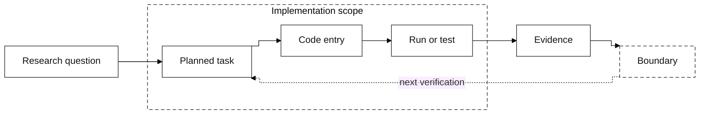

# Workflow Diagram Contract

This contract defines the workflow source and visual artifact consumed by
`beamer-academic`. Mermaid carries semantics; `diagram-design` owns the final
editorial redraw. The diagram is an evidence map, not a replacement for the
status table or the underlying test output.

## Visual target

Match the supplied reference image:

- white canvas;
- black or dark-gray serif labels and strokes;
- rectangular process blocks;
- dashed outer grouping boxes;
- orthogonal arrows and compact labels;
- feedback loops only where they explain iteration;
- no decorative gradients, icons, or terminal/editor screenshots.

## Mermaid semantic baseline

Start from this structure and adapt labels to the actual project:

Treat this as a semantic scaffold only. Use concise Chinese labels in the final
figure when the presentation is in Chinese. Put exact file paths, function
names, line numbers, and evidence IDs in the accompanying Markdown table rather
than making boxes unreadable.

## Diagram-design handoff

Invoke the local `diagram-design` skill with:

| Dial | Beamer default |
|---|---|
| format | `html+png` |
| size | `slide-16x9` or configured `slide-4x3` |
| detail | `balanced` (drop to `simplified` when the slide is crowded) |
| audience | `engineer` for code review, `mixed` for group meeting |

Choose the nearest semantic type (`flowchart`, `process`, or `data-flow`),
load its type reference, redraw from the Mermaid meaning rather than copying
automatic Mermaid coordinates, and record the fidelity ledger when nodes are
merged or dropped. The diagram-design connector rules require orthogonal,
independently traceable elbows and disallow connector overlap.

## Representation choice

| Need | Preferred representation | Reason |
|---|---|---|
| Exact plan → code → test topology | Mermaid | Editable, source-aware, easy to review |
| Dense dependency geometry Mermaid cannot express | Graphviz or TikZ | More control over routing and grouping |
| Conceptual physical mechanism | `imagegen` as an `AI示意图` | Useful only when exact paths/formulas/evidence are not required |

Do not use `imagegen` to represent exact file names, formulas, code topology,
measured plots, or completion evidence.

## Rendering

1. Save the semantic source as `workflow.mmd`.
2. Use `diagram-design` to produce `workflow.html` and export `workflow.png`
   for the Beamer slide; retain `workflow.svg` only as an optional vector/web
   preview.
3. If the local diagram skill is unavailable, use Graphviz or TikZ and record
   the fallback in the report frontmatter.
4. Inspect the PNG at slide size. Text must remain readable and the
   grouping/feedback structure must survive downscaling.
5. Never use a terminal or editor screenshot as the workflow figure.

## Evidence boundary

The diagram shows relationships and current boundaries. Completion status comes
from the plan-to-code table, test/run output, figures, or explicit `unknown` /
`none` evidence—not from the existence of a box or an arrow.
